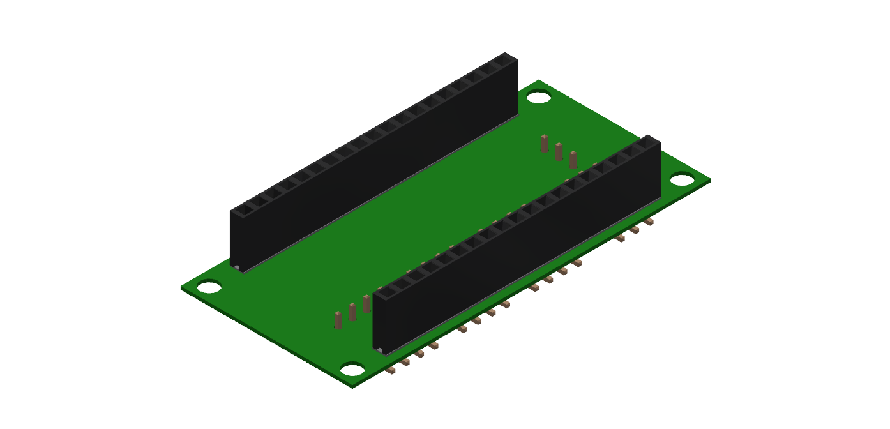
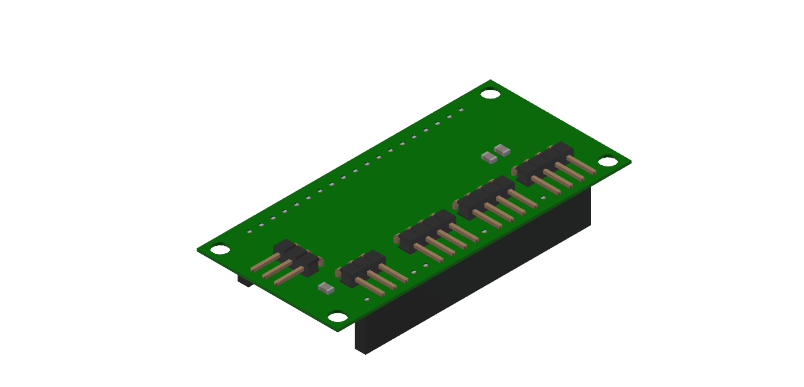

## PCB Design

The idea of the PCB was to make a simple connection from sensors to the ESP32. Three I2C and one OneWire interfaces were used for the PCB. Most of the sensors can communicate with I2C therefore  a connection with I2C is easy because everything is on a bus and speed is not that important in our case. Pull-up resistors were used for the data lines and Vcc. Male pin headers were used as connectors for the sensors.

## Case

The idea for the case of the PCB was to make a universal use for a realisation of any sensor combination for our application. Threaded inserts were used to mount the PCB/sensors to the housing. 

- M3 for the PCB
- M2.5 for VEML7700, LPS25 and DHT22
- M2 for SCD30

For the cover 2 variations were constructed. A closed one and one a opened one for the light sensor VEML7700. For the connection of cover and housing a simple snap connection was chosen. Grooves were added to the sides of the housing and to the cover to guarantee a sufficient air supply.

